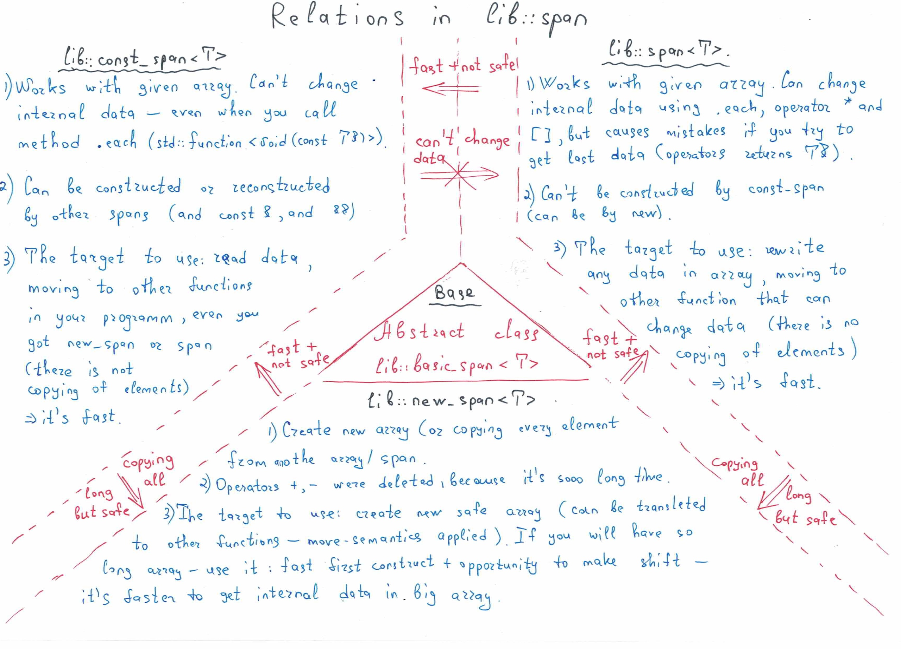

# Span #

### Work with arrays like iterators! ###

##### Short info #####
There is no more than convinient opportunity to work with old arrays - it means that my span provide a part of std::array <T> (the base things), but I added some extreamly useful things:

##### Main #####
There are const_span and span ( not const))) )
	The difference - in const you can't change objects))))

Functions you can find in .h at first strings after definings
The most important
*	each(std::function <void(const T&)>) or void(T&) - last things can't be used by const_span<T>. It means that you can use lambda-functions, std::bind, pointers to function and so on. Programm will check boundaries and using every element. 
*	sometimes it neccesary to know what is index of this variable in array, that's why don't forget - you can use function with types <void(const T&, std::size_t)> and for pure span <void(T&, std::size_t)>

*	we have an iterator too - you can move array down and up as many as you want - it's safe, but sometimes it provides you some warning)))
*	don't forget about function to_start() and to_end() - it move your iterator exactly to first element and to the place after last (like other iterators, last element not a last iterator). But operator * of last element can provide some warnings and errors if you're on end_place. Be careful!)

##### Extra #####
I added some warnings and error - you should to read them, sometimes it can help to do your programm better